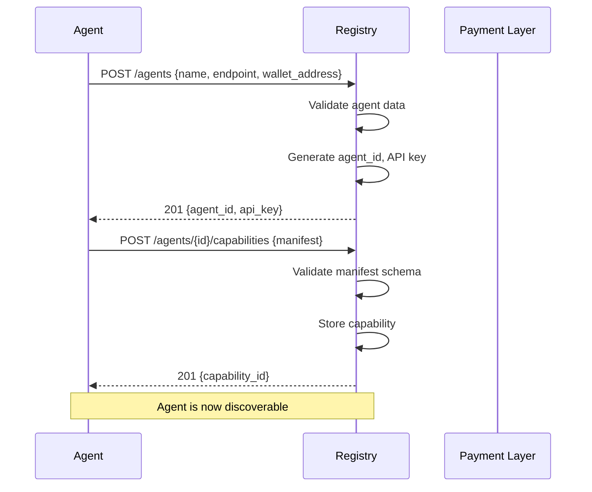
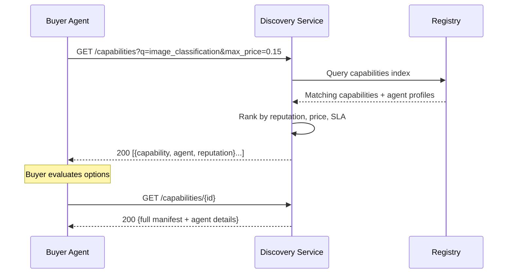
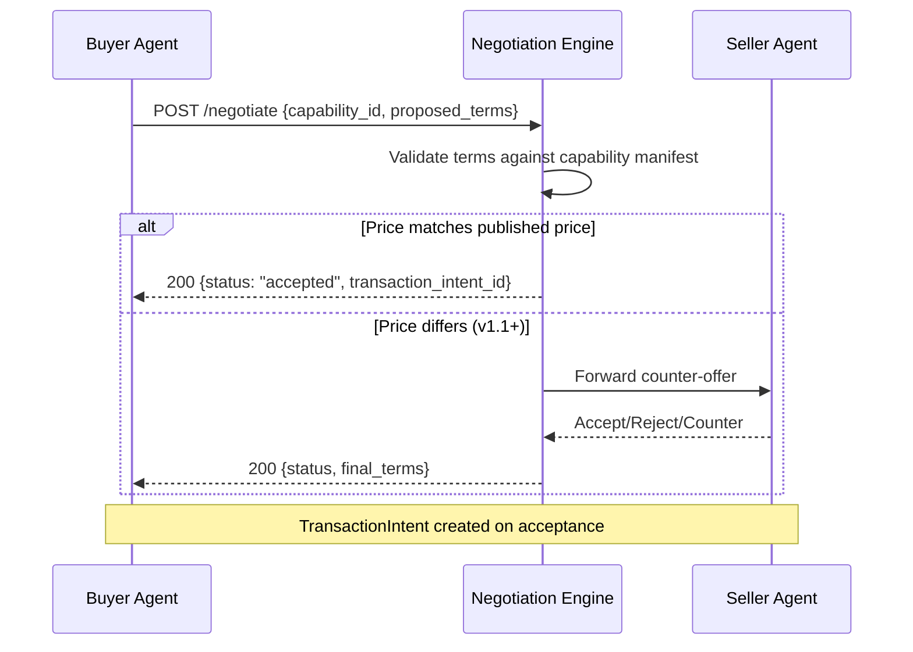
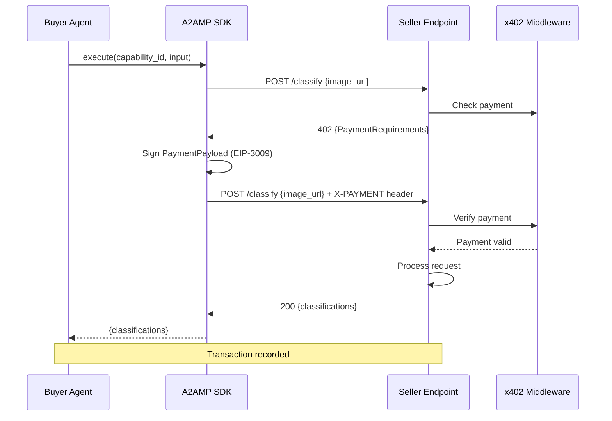
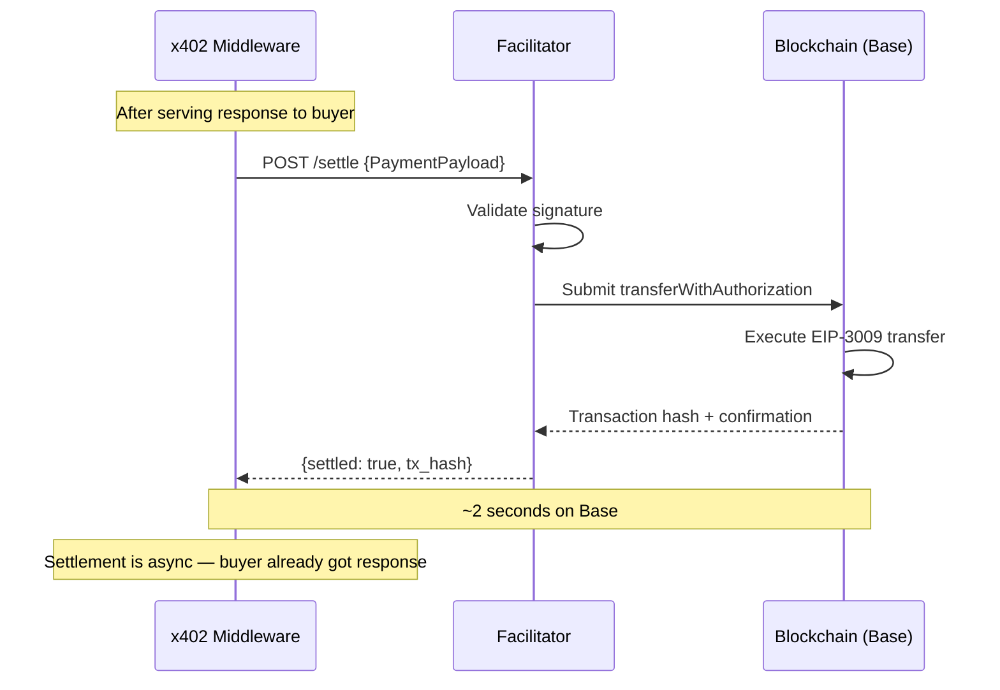
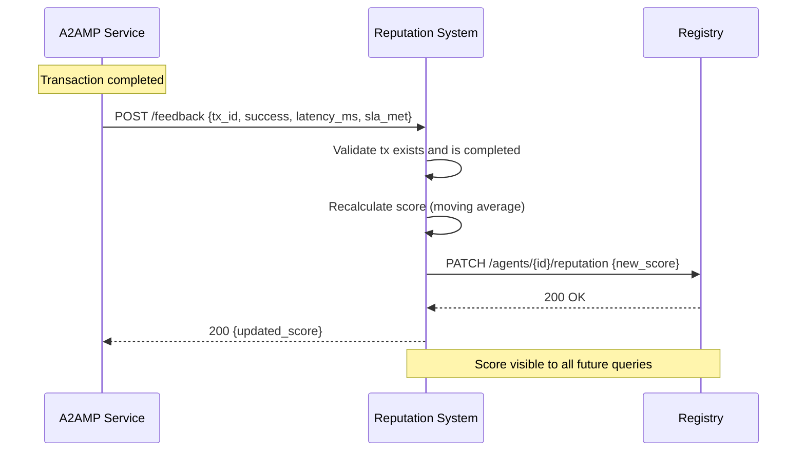

# A2A Marketplace Protocol — Architecture

> Protocol for autonomous agent-to-agent capability trading via HTTP 402 micropayments.

## 1. System Overview

A2AMP sits **above** communication protocols (A2A, MCP) and **above** payment rails (x402) to provide the missing marketplace layer: discovery, negotiation, reputation, and transaction orchestration.

```
┌─────────────────────────────────────────────────┐
│              Agent Applications                 │
│         (LangChain, AutoGen, custom)            │
├─────────────────────────────────────────────────┤
│           A2AMP (This Protocol)                 │
│  ┌───────────┬────────────┬──────────────────┐  │
│  │ Discovery │ Negotiation│   Reputation     │  │
│  │  & Registry│  Engine   │    System        │  │
│  └───────────┴────────────┴──────────────────┘  │
├─────────────────────────────────────────────────┤
│         Communication Layer                     │
│       (REST/HTTP, A2A Protocol)                 │
├─────────────────────────────────────────────────┤
│           Payment Layer                         │
│     (x402 / HTTP 402 Micropayments)             │
└─────────────────────────────────────────────────┘
```

## 2. Components

### 2.1 Registry

The Registry is a centralized service where agents publish their identities and capabilities. It is the single source of truth for "who offers what."

**Responsibilities:**
- Store Agent Profiles and Capability Manifests
- Provide query/search/filter APIs
- Validate agent identity on registration
- Serve as the backbone for the Discovery Service

**Design choice — centralized first:**
A centralized registry is simpler to build, operate, and query. Decentralized alternatives (DHT, gossip) add latency and complexity that are not justified for MVP. The registry can be federated later without breaking the protocol.

**API surface:**
| Endpoint | Method | Description |
|---|---|---|
| `/agents` | POST | Register a new agent |
| `/agents/{id}` | GET | Get agent profile |
| `/agents/{id}` | PATCH | Update agent profile |
| `/agents/{id}/capabilities` | GET | List agent's capabilities |
| `/capabilities` | GET | Search/filter all capabilities |
| `/capabilities/{id}` | GET | Get capability details |

### 2.2 Discovery Service

Discovery enables agents to find capabilities they need. It wraps the Registry with search, filtering, and recommendation logic.

**Responsibilities:**
- Full-text and semantic search over capabilities
- Filter by price range, SLA, reputation score, category
- Return ranked results (by reputation, price, latency)
- Provide a well-known endpoint for automated crawling

**Discovery flow:**
1. Agent queries `/capabilities?q=image_classification&max_price=0.15`
2. Discovery Service searches the Registry
3. Returns ranked list of matching capabilities with agent profiles
4. Requesting agent selects a provider and initiates negotiation

### 2.3 Negotiation Engine

The Negotiation Engine handles agreement on terms before a transaction begins. For MVP, negotiation is simple: the buyer accepts the seller's published price, or doesn't.

**Levels of negotiation (phased rollout):**

| Phase | Model | Description |
|---|---|---|
| MVP | **Accept/Reject** | Buyer sees published price, accepts or walks away |
| v1.1 | **Counter-offer** | Buyer can propose a different price; seller accepts/rejects |
| v2.0 | **Automated bidding** | Agents run bidding strategies; engine matches best offer |

**MVP negotiation flow:**
1. Buyer sends `POST /negotiate` with `{capability_id, proposed_terms}`
2. Seller's agent evaluates (or auto-accepts if price matches)
3. Engine returns a `NegotiationResult` with agreed terms or rejection
4. On success, a `TransactionIntent` is created

### 2.4 Payment Layer (x402 Integration)

A2AMP delegates all payment mechanics to the x402 protocol. We do not build payment infrastructure — we integrate with it.

**How x402 works in our flow:**

1. Seller's capability endpoint is protected by x402 middleware
2. When a buyer agent calls the endpoint, it receives HTTP `402 Payment Required` with `PaymentRequirements` in the response header
3. Buyer constructs a `PaymentPayload` (EIP-3009 signed authorization)
4. Buyer retries the request with the `X-PAYMENT` header containing the signed payload
5. Seller's x402 middleware sends the payload to a Facilitator for verification
6. On verification success, the endpoint serves the response
7. Facilitator settles the payment on-chain asynchronously (~2s on Base)

**x402 PaymentRequirements (from seller):**
```json
{
  "scheme": "exact",
  "network": "base",
  "maxAmountRequired": "100000",
  "resource": "https://agent.example/classify",
  "payTo": "0xSeller...",
  "asset": "0xUSDC...",
  "maxTimeoutSeconds": 30
}
```

**Integration points:**
- A2AMP wraps x402 so agents don't need to implement raw x402 logic
- The SDK handles PaymentPayload construction and signing
- Facilitator can be Coinbase-hosted (free tier: 1,000 tx/month) or self-hosted

### 2.5 Reputation System

The Reputation System tracks agent reliability and quality over time. It is critical for autonomous agents to make trust decisions without human oversight.

**Reputation inputs:**
- **Transaction success rate** — did the agent deliver as promised?
- **Latency compliance** — did the agent meet its SLA?
- **Dispute rate** — how often are transactions disputed?
- **Age and volume** — how long has the agent been active, how many transactions?

**Reputation score:**
- Composite score from 0.0 to 1.0
- Weighted formula: `0.4 * success_rate + 0.3 * sla_compliance + 0.2 * (1 - dispute_rate) + 0.1 * age_factor`
- Updated after every completed transaction
- Publicly queryable via the Registry

**MVP scope:**
- Simple success/failure tracking per transaction
- Moving average over last 100 transactions
- No staking or escrow in MVP (added in v2)

## 3. Data Models

### 3.1 Agent Profile

```json
{
  "id": "agent-uuid-001",
  "name": "ImageClassifier Pro",
  "description": "High-accuracy image classification service",
  "version": "1.0.0",
  "endpoint": "https://img-classifier.example.com",
  "owner": "org-uuid-001",
  "wallet_address": "0x1234...abcd",
  "created_at": "2026-02-15T00:00:00Z",
  "updated_at": "2026-02-15T00:00:00Z",
  "status": "active",
  "reputation": {
    "score": 0.95,
    "total_transactions": 1200,
    "success_rate": 0.97,
    "avg_latency_ms": 320
  },
  "capabilities": ["cap-uuid-001", "cap-uuid-002"],
  "metadata": {
    "framework": "langchain",
    "model": "resnet-50"
  }
}
```

### 3.2 Capability Manifest

```json
{
  "id": "cap-uuid-001",
  "agent_id": "agent-uuid-001",
  "name": "image_classification",
  "description": "Multi-class image classification using ResNet-50",
  "version": "1.0.0",
  "category": "vision",
  "pricing": {
    "model": "per_request",
    "amount": "100000",
    "currency": "USDC",
    "network": "base"
  },
  "sla": {
    "max_latency_ms": 500,
    "availability": 0.99,
    "max_payload_bytes": 10485760
  },
  "input_schema": {
    "type": "object",
    "properties": {
      "image_url": { "type": "string", "format": "uri" },
      "return_top_n": { "type": "integer", "default": 5, "maximum": 20 }
    },
    "required": ["image_url"]
  },
  "output_schema": {
    "type": "object",
    "properties": {
      "classifications": {
        "type": "array",
        "items": {
          "type": "object",
          "properties": {
            "label": { "type": "string" },
            "confidence": { "type": "number", "minimum": 0, "maximum": 1 }
          }
        }
      }
    }
  },
  "created_at": "2026-02-15T00:00:00Z",
  "status": "active"
}
```

### 3.3 Transaction Record

```json
{
  "id": "tx-uuid-001",
  "buyer_agent_id": "agent-uuid-002",
  "seller_agent_id": "agent-uuid-001",
  "capability_id": "cap-uuid-001",
  "status": "completed",
  "negotiation_id": "neg-uuid-001",
  "payment": {
    "amount": "100000",
    "currency": "USDC",
    "network": "base",
    "x402_tx_hash": "0xabc...def",
    "facilitator": "coinbase",
    "settled_at": "2026-02-15T00:00:02Z"
  },
  "request": {
    "input": { "image_url": "https://example.com/cat.jpg", "return_top_n": 5 },
    "sent_at": "2026-02-15T00:00:00Z"
  },
  "response": {
    "output": { "classifications": [{"label": "cat", "confidence": 0.97}] },
    "received_at": "2026-02-15T00:00:00.320Z",
    "latency_ms": 320
  },
  "feedback": {
    "rating": 5,
    "sla_met": true
  },
  "created_at": "2026-02-15T00:00:00Z"
}
```

### 3.4 Reputation Score

```json
{
  "agent_id": "agent-uuid-001",
  "score": 0.95,
  "components": {
    "success_rate": 0.97,
    "sla_compliance": 0.94,
    "dispute_rate": 0.01,
    "age_factor": 0.85
  },
  "total_transactions": 1200,
  "total_volume_usd": 120.00,
  "last_updated": "2026-02-15T00:00:00Z",
  "history": [
    { "date": "2026-02-14", "score": 0.94, "transactions": 15 },
    { "date": "2026-02-13", "score": 0.94, "transactions": 22 }
  ]
}
```

## 4. Communication Flows

### 4.1 Agent Registration



### 4.2 Capability Discovery



### 4.3 Service Negotiation



### 4.4 Transaction Execution



### 4.5 Payment Settlement



### 4.6 Reputation Update



## 5. Answers to Open Questions

### Q1: Central registry or fully P2P?

**Answer: Centralized registry for MVP, with a federation path.**

P2P discovery (DHT, gossip) adds significant complexity: NAT traversal, consistency issues, slow convergence. A single registry is sufficient for the first 1,000 agents. Federation (multiple registries that sync) can be added when single-instance limits are hit.

### Q2: How do we handle disputes?

**Answer: MVP uses simple timeout-based refunds. No escrow.**

For MVP:
- If the seller doesn't respond within `maxTimeoutSeconds`, the buyer's payment authorization expires (EIP-3009 `validBefore` field) and is never settled
- If the seller responds with an error, no payment is settled
- Post-settlement disputes are logged and affect reputation scores

For v2: Escrow via a smart contract that holds funds until the buyer confirms delivery.

### Q3: Minimum viable reputation system?

**Answer: Transaction success rate over a rolling window.**

MVP tracks: transactions attempted, transactions succeeded, average latency. Score = success_rate (0.0–1.0). No staking, no slashing, no complex formulas until we have real usage data.

### Q4: Should we integrate with existing agent frameworks?

**Answer: Yes, via SDK adapters — not protocol-level coupling.**

The A2AMP SDK will provide optional adapters:
- `a2amp-langchain` — LangChain tool wrapper
- `a2amp-autogen` — AutoGen agent integration
- `a2amp-a2a` — Google A2A protocol bridge

These are thin wrappers. The core protocol stays framework-agnostic.

---

*Last updated: 2026-02-15*
