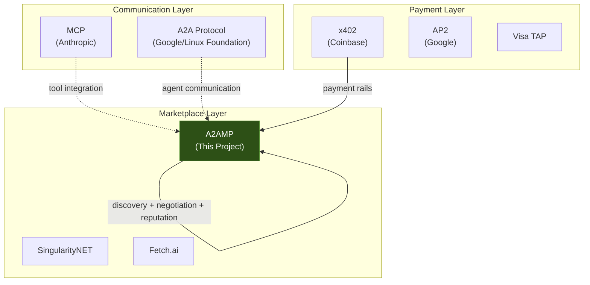
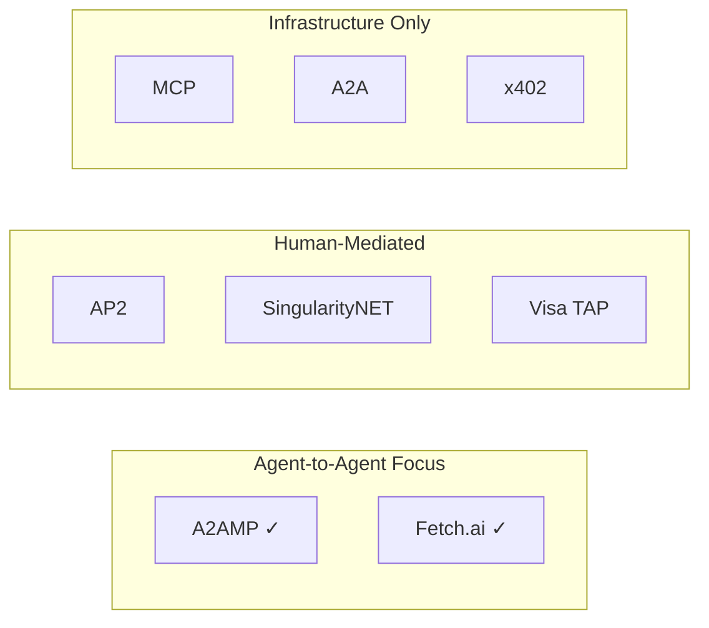

# A2A Marketplace Protocol — Competitive Analysis

> Where A2AMP fits in the agent protocol landscape as of February 2026.

## 1. Landscape Overview

The agent interoperability space has three distinct layers. Most existing protocols address only one or two. A2AMP targets the gap.

## 2. Protocol-by-Protocol Comparison

### 2.1 MCP (Model Context Protocol) — Anthropic

**What it does:** Standardizes how LLMs connect to external tools and data sources. An LLM calls MCP tools the way a browser calls APIs.

**Key characteristics:**
- Tool discovery and invocation
- Structured input/output schemas
- Client-server architecture (LLM is the client)
- No native authentication standard
- No payment capability
- No agent-to-agent communication (it's model-to-tool)

**How A2AMP relates:**
MCP is complementary, not competitive. MCP connects an LLM to tools; A2AMP connects agents to other agents' services. An agent built with MCP tools could use A2AMP to discover and pay for remote capabilities. We can build an MCP tool adapter (`a2amp-mcp`) that exposes marketplace capabilities as MCP tools.

**Gap A2AMP fills:** MCP has no concept of pricing, payments, or marketplace economics. An agent using MCP can call a tool, but cannot negotiate a price or pay for it.

---

### 2.2 A2A Protocol (Agent-to-Agent) — Google / Linux Foundation

**What it does:** Enables AI agents built on different frameworks to communicate and collaborate. Merged with IBM's ACP (Agent Communication Protocol) under the Linux Foundation in September 2025.

**Key characteristics:**
- Agent Cards for capability advertisement (JSON-based identity)
- Task-based communication model
- Streaming support via SSE
- Framework-agnostic (works across LangChain, AutoGen, Vertex, etc.)
- 150+ organizations in the ecosystem
- No native payment mechanism
- Discovery via Agent Cards (but no centralized search)

**How A2AMP relates:**
A2A provides the communication substrate. A2AMP provides the economic layer on top. An agent's A2A Agent Card could reference its A2AMP capabilities and pricing. We use A2A for the actual agent-to-agent message exchange and add pricing/payment/reputation on top.

**Gap A2AMP fills:** A2A lets agents talk to each other but has no mechanism for agents to charge each other. The A2A x402 extension exists (by Google/Coinbase) but it's a point solution for individual payments, not a marketplace with discovery, reputation, and negotiation.

---

### 2.3 x402 — Coinbase

**What it does:** HTTP-native payment protocol using the `402 Payment Required` status code. Enables any HTTP endpoint to charge for access using stablecoins (USDC) on Base, Solana, and other chains.

**Key characteristics:**
- Built on EIP-3009 (TransferWithAuthorization) for gasless payments
- ~100ms verification, ~2s settlement on Base
- Facilitator model (Coinbase-hosted or self-hosted)
- x402 Bazaar for service discovery (centralized index)
- V2 adds Discovery extension, SIWx sessions, multi-chain
- TypeScript and Go SDKs available
- Free tier: 1,000 transactions/month via Coinbase facilitator

**How A2AMP relates:**
x402 is our payment rail. A2AMP does not compete with x402 — it builds on top of it. x402 handles the "how do I pay" question. A2AMP handles "who should I pay, how much is fair, and can I trust them."

**Gap A2AMP fills:** x402 Bazaar is a simple service index, not a marketplace. It lacks:
- Reputation/trust scoring
- Automated negotiation
- Capability-based search with SLA filtering
- Transaction history and analytics
- Agent identity beyond wallet addresses

---

### 2.4 AP2 (Agent Payments Protocol) — Google

**What it does:** Commerce layer for the agent economy. Announced September 2025 by Google Cloud and Coinbase. Provides wallets, settlement rails, and compliance infrastructure for agent-to-agent payments.

**Key characteristics:**
- Uses Mandates (cryptographically-signed digital contracts) for consent
- Supports cards, bank transfers, and stablecoins (x402 as default rail)
- Discovery via A2A Agent Cards
- Enterprise-grade: DID-based identity, audit logs, compliance scaffolding
- Backed by Mastercard, PayPal, American Express, Coinbase, Shopify, Stripe
- Focused on human-to-merchant commerce mediated by agents

**How A2AMP relates:**
AP2 is focused on **human commerce through agents** (a human tells their agent to buy something from a merchant). A2AMP is focused on **agent-to-agent autonomous trade** (agents buying capabilities from each other without human involvement).

**Gap A2AMP fills:** AP2's Mandates require human consent per transaction. A2AMP enables fully autonomous agent spending within pre-set budgets. AP2 is also enterprise-heavy — DID infrastructure, compliance layers, multi-party credential management. A2AMP is lightweight by design.

---

### 2.5 Fetch.ai (ASI Alliance)

**What it does:** Blockchain-based platform for autonomous economic agents. Agents register, discover each other, and transact using the FET/ASI token on the Fetch.ai network.

**Key characteristics:**
- Built on Cosmos SDK blockchain
- FET/ASI token required for all transactions
- Agent-based discovery via Almanac (on-chain registry)
- uAgents framework for building agents
- Part of the ASI Alliance (merged with SingularityNET, Ocean Protocol)
- Token-gated: agents need FET to register and transact

**How A2AMP relates:**
Fetch.ai is the closest direct competitor in terms of vision (autonomous agent economy). The key differentiators:

| Aspect | A2AMP | Fetch.ai |
|---|---|---|
| Payment | USDC stablecoins via x402 | FET/ASI token |
| Infrastructure | HTTP/REST, no blockchain required | Cosmos blockchain |
| Barrier to entry | HTTP endpoint + wallet | Deploy on Fetch chain |
| Settlement speed | ~2s (Base L2) | ~6s (Cosmos) |
| Token requirement | None (USDC is universal) | Must hold FET |
| Discovery | REST API search | On-chain Almanac |

**Gap A2AMP fills:** Fetch.ai requires agents to operate within its blockchain ecosystem. A2AMP works with any HTTP-capable agent, paying with widely-held stablecoins instead of a specialized token. Lower barrier to entry, faster integration, no blockchain expertise required.

---

### 2.6 SingularityNET (ASI Alliance)

**What it does:** Decentralized AI marketplace where developers publish AI services and users pay with ASI tokens. Merged with Fetch.ai and Ocean Protocol into the ASI Alliance.

**Key characteristics:**
- Web-based marketplace DApp
- ASI token for payments
- Blockchain-based service registry (Ethereum events)
- Human-facing UI (not agent-first)
- Free demo calls for each service
- PayPal integration for fiat payments
- ASI:Chain DevNet launched November 2025

**How A2AMP relates:**
SingularityNET is the most established AI marketplace but is designed for **humans browsing and buying AI services**, not for autonomous agents discovering and transacting with each other.

| Aspect | A2AMP | SingularityNET |
|---|---|---|
| Target user | Autonomous agents | Human developers |
| UI required | No (protocol-first) | Yes (web DApp) |
| Payment | USDC stablecoins | ASI token + PayPal |
| Discovery | API-first, agent-queryable | Web UI, human-browsable |
| Automation | Fully autonomous | Manual selection + payment |
| Reputation | Automated, per-transaction | Star ratings by humans |

**Gap A2AMP fills:** SingularityNET cannot support autonomous agent-to-agent trade. Its discovery and payment flows require human interaction. A2AMP is protocol-first: no browser needed, no human in the loop.

---

### 2.7 Visa Trusted Agent Protocol (TAP)

**What it does:** Framework for merchants to distinguish legitimate AI agents from bots, enabling secure agent-driven checkout. Announced October 2025.

**Key characteristics:**
- Focused on consumer commerce (agents shopping for humans)
- Built on existing web infrastructure
- 10+ launch partners
- Plans for mainstream adoption by 2026 holiday season
- Working with Google, OpenAI, Stripe for compatibility

**How A2AMP relates:**
TAP is about **human commerce** — agents buying physical goods and services on behalf of consumers. A2AMP is about **digital capability trade** between agents. There is no overlap in the current scope, but TAP's merchant verification patterns could inform A2AMP's reputation system.

---

## 3. Comparison Matrix

| Feature | A2AMP | MCP | A2A | x402 | AP2 | Fetch.ai | SingularityNET |
|---|:---:|:---:|:---:|:---:|:---:|:---:|:---:|
| Agent discovery | **Yes** | No | Partial | Bazaar | Via A2A | Almanac | Web UI |
| Capability search | **Yes** | No | No | Basic | No | On-chain | Web UI |
| Pricing/negotiation | **Yes** | No | No | Fixed | Mandates | Fixed | Fixed |
| Payment | **x402** | No | No | Native | Multi-rail | FET token | ASI token |
| Reputation | **Yes** | No | No | No | Audit logs | No | Star ratings |
| Blockchain required | **No** | No | No | Yes (L2) | Optional | Yes | Yes |
| Token required | **No** | No | No | USDC | Varies | FET | ASI |
| Agent-first | **Yes** | No | Yes | Yes | Partial | Yes | No |
| Open source | **Yes** | Yes | Yes | Yes | Partial | Yes | Yes |

## 4. Integration Strategy

A2AMP is not trying to replace these protocols — it layers on top of them.

### Integration points:

1. **x402** — Payment rail. A2AMP wraps x402 in its SDK so agents don't implement raw payment flows.

2. **A2A Protocol** — Communication layer. A2AMP can use A2A for agent-to-agent messaging. Agent Cards can reference A2AMP capability IDs.

3. **MCP** — Tool layer. A2AMP capabilities can be exposed as MCP tools, so any MCP-compatible LLM can discover and use marketplace services.

4. **AP2** — Co-existence. For transactions that need human consent (high-value, regulated), A2AMP can delegate to AP2's Mandate flow. For autonomous micro-transactions, A2AMP handles directly.

### Why agents choose A2AMP:

1. **No token buy-in.** Pay with USDC, not a platform-specific token. No need to acquire FET, ASI, or any other token before using the marketplace.

2. **No blockchain expertise.** The SDK handles wallet management, payment signing, and settlement. Agents just call `marketplace.buy(capability, input)`.

3. **HTTP-native.** Any agent that can make HTTP requests can participate. No Cosmos SDK, no Ethereum smart contracts, no DApp deployment.

4. **Reputation built-in.** Agents can make trust decisions autonomously based on on-protocol reputation scores, not off-chain reviews.

5. **Protocol-first.** No web UI required. Everything is an API. Built for machines, not humans.

---

## 5. Risk Analysis

| Risk | Impact | Mitigation |
|---|---|---|
| x402 Bazaar adds marketplace features | Reduces A2AMP's differentiation | Build reputation + negotiation layers that Bazaar won't |
| AP2 expands to autonomous agent trade | Direct competition from Google-backed protocol | Move fast, establish network effects, keep it simple |
| A2A adds native payment support | Reduces need for separate marketplace layer | Integrate deeply with A2A, become the recommended marketplace extension |
| Fetch.ai drops token requirement | Removes key differentiator | Compete on UX, simplicity, and HTTP-native design |
| Low adoption — chicken-and-egg problem | No buyers without sellers, no sellers without buyers | Seed the marketplace with demo agents, offer free tier |

---

*Last updated: 2026-02-15*
